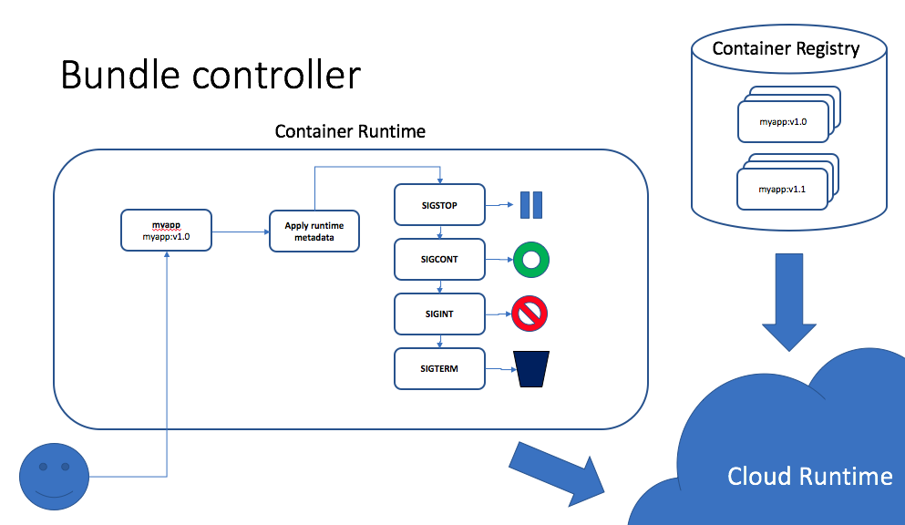

# Duffle: The CNAB Package Manager

Duffle is a package manager and build tool for CNAB bundles. This document reflects the current design thinking for Duffle.

## The Scope of Duffle

Duffle is intended to perform the following tasks:

- Build Duffle images from resources
- Push and pull CNAB bundles to image registries
- Install, upgrade, and delete CNAB images
- Import and export CNAB bundles (e.g. for moving CNABs offline)
- Managing the duffle environment

*Note:* `duffle init` must be added later, but is currently out of scope due to ambiguity of requirements.

## Building packages with `duffle build`

the `duffle build` command takes a file-based representation of a CNAB bundle, combined with Duffle configuration, and builds a CNAB bundle.

It builds invocation images. When a Duffle applicatiomn is multi-container, it also will build those images.

### Example

Consider an application named `myapp` with a `manifest.json` like this:

```json
{ ​
  "name": "example/myapp",​
  "version": "0.1.0",​
  "images": [​
    { ​
      "name": "myapp-server",​
      "uri": "example/myapp-server:a5ff67...",​
      "refs": []​
    }​
  ]​
}
```

Running `duffle build` on the directory should create two images: the invocation image named `example/myapp:0.1.0` and an app image named `example/myapp-server:a5ff67...`.

The building of the second image may be managed via configuration in a project-based `duffle.yaml` file, which will map the image name to a Dockerfile and local environment.

## Duffle Run

TODO: The present design suggests only that `duffle run` "runs the bundle" (e.g. like `docker run`). However, this is not how package installers work, and it's unclear how the stated goal of CNAB is accomplished by this command. So we need to think this through.

## Pushing images to a registry with `duffle push`

The `duffle push` command will push a built CNAB bundle's images into the pre-configured container registry.

For example, if the `duffle build` produced `example/myapp:0.1.0` and `example/myapp-server:a5ff67...`, the `duffle push` command would push both of those to the DockerHub registry.

## Fetching CNAB bundles with `duffle pull`

The `duffle pull` command will pull a named CNAB bundle from a registry to a local Docker/Moby daemon.

For example, `duffle pull example/myapp:0.1.0` would fetch the image `example/myapp:0.1.0`, which is an invocation image. It would then inspect the `manifest.json` in that image and fetch the associated `example/myapp-server:a5ff67...` image as well.

TODO: We are investigating storing the manifest in the registry and fetching that directly, which allows parallelizing the pull and also does not require a Docker runtime for fetching. Additionally, it may open the possibility of using a VM image for initialization.

## Exporting a CNAB bundle with `duffle export`

The `duffle export` command exports a invocation image together with all of its associated images, generating a single gzipped tar file as output.

The "thick" representation of an export includes all of the layers of all of the images.

The "thin" representation of an export includes only the invocation image.

## Importing a CNAB bundle with `duffle import`

The `duffle import` command imports an exported Duffle image.

For thick images, it will load the images into the local registry.

For thin images, it will (if necessary) pull the dependent images from a registry and load them into the local Docker/Moby daemon.

## TODO

The following items remain to be specified:

- How configuration data is passed into bundles
- The format and contents of `duffle.yaml`
- How Duffle does install/upgrade/delete
- How Duffle will use signals
- How Duffle does `duffle run` for a production grade long-lived application
- How Duffle does state management for installations
- How `duffle init` works, or whether that is done by a separate tool (or set of tools).
- Whether Duffle will support multi-runtimes in a single image.

| Method | Description |
| naive | A CNAB bundle can have only configurational runtime |
| intentional | A CNAB bundle can expose toggle switches for which runtimes (e.g. Mesos vs Kubernetes), and user chooses |
| automatic | A CNAB bundle may expose multiple runtimes, but automatically choose which applies to the current config |

## The Invocation Container Lifecycle

The invocation image is at least responsible for installing something. But to work as a package manager, it must manage the lifecycle of the application. In turn, this means that it must have a lifecycle.

Options currently are:

- Invocation container produces a state file to indicate the state of the release, and `duffle` acts on these files
- OR Invocation container stays running for as long as the application is "installed", and signals are sent between Duffle and this image
    - Requires persistent container engine to keep the invocation image running
    - Container naming becomes somewhat important
    - Signals are given specific meaning (see diagram below)
- OR Invocation container becomes a server, and stays running, exposing API surface (and this has lots of security implications)
- OR State is stored in stable accessible storage and `duffle` knows how to get to it

Example:

Here is an image expressing the signals model (second item above):



TODO: What from the slide deck do we move here?


